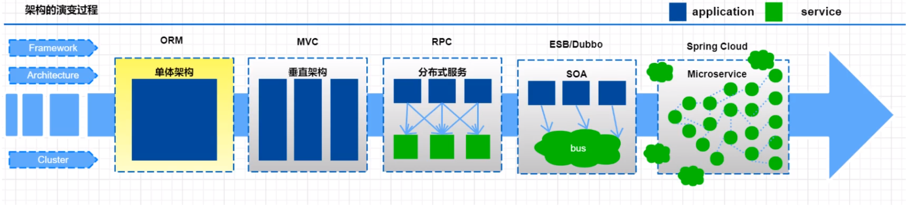
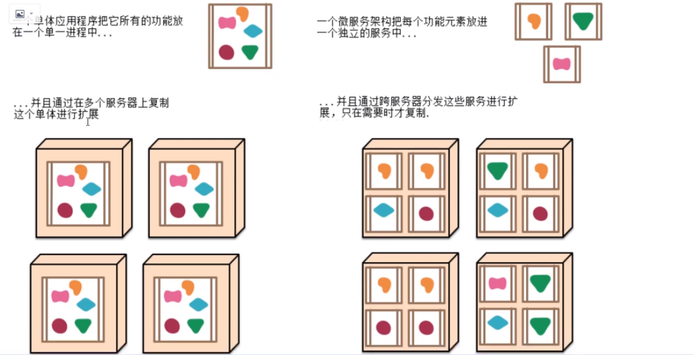
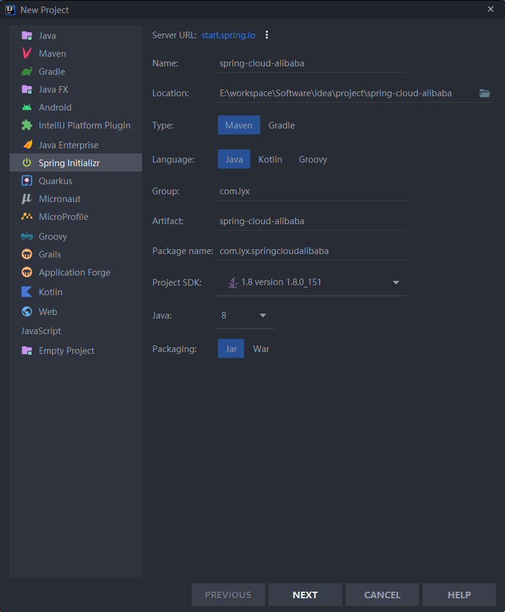
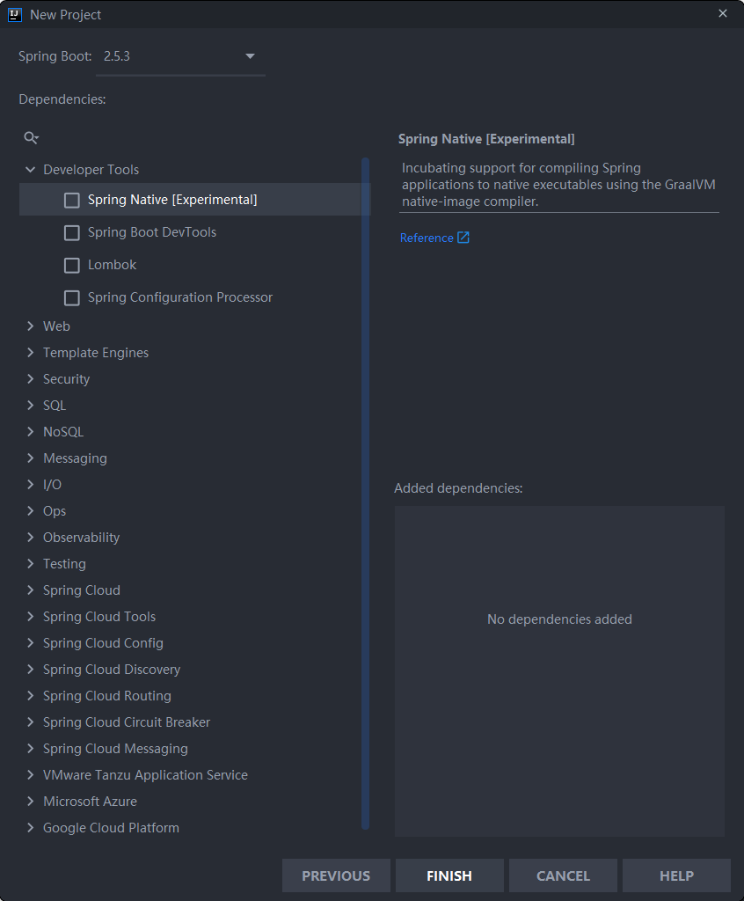
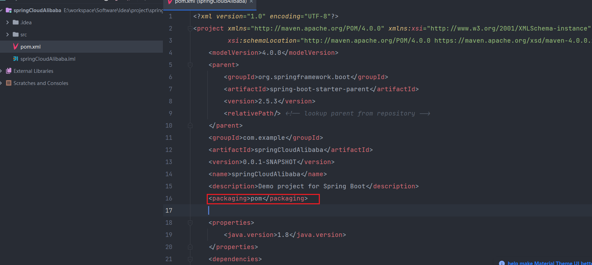

# Spring Cloud Alibaba笔记


## 1. 微服务和Spring Cloud Alibaba介绍

### 1.1 微服务介绍

#### 1.1.1 系统架构演变

随着互联网的发展，网站应用的规模也在不断的扩大，进而导致系统架构也在不断的进行变化。

从互联网早起到现在，系统架构大体经历了下面几个过程：单体应用架构→垂直应用架构一>分布式架构—>SOA架构→微服务架构，当然还有悄然兴起的Service Mesh(服务网格化）。



接下来我们就来了解一下每种系统架构是什么样子的，以及各有什么优缺点。


##### 1.单体应用架构

互联网早期，一般的网站应用流量较小，只需一个应用，将所有功能代码都署在一起就可以，这样可以减少开发、部署和维护的成本。比如说一个电商系统，里面会包含很多用户管理，商品管理，订单管理，物流管理等等很多模块，我们会把它们做成一个web项目，然后部署到一台tomcat服务器上。

**优点：**

* 项目架构简单，小型项目的话，开发成本低
* 项目部署在一个节点上，维护方便

**缺点：**

* 全部功能集成在一个工程中，对于大型项目来讲不易开发和维护
* 项目模块之间紧密精合，单点容错率低
* 无法针对不同模块进行针对性优化和水平扩展


##### 2. 垂直应用架构

随着访问量的逐渐增大，单一应用只能依靠增加节点来应对，但是这时候会发现并不是所有的模块都会有比较大的访问量.还是以上面的电商为例子，用户访问量的增加可能影响的只是用户和订单模块，但是对消息模块的影响就比较小.那么此时我们希望只多增加几个订单模块，而不增加消息模块.此时单体应用就做不到了，垂直应用就应运而生了.

所谓的垂直应用架构，就是将原来的一个应用拆成互不相干的几个应用，以提升效率。比如我们可以将上面电商的单体应用拆分成：

* 电商系统（用户管理商品管理订单管理）
* 后台系统（用户管理订单管理客户管理）
* CMS系统（广告管理营销管理）

这样拆分完毕之后，一旦用户访问量变大，只需要增加电商系统的节点就可以了，而无需增加后台和CMS的节点。

**优点：**

* 系统拆分实现了流量分担，解决了并发问题，而且可以针对不同模块进行优化和水扩展
* 一个系统的问题不会影响到其他系统，提高容错率

**缺点：**

* 系统之间相互独立，无法进行相互调用
* 系统之间相互独立，会有重复的开发任务


##### 3. 分布式架构

再直应用越来越多，重复的业务代码就会越来越多。这时候，我们就思考可不可以将重复的代码抽取出来，做成统一的业务层作为独立的服务，然后由前端用不同的业务层服务呢？

这就产生了新的分布式系统架构。它将把工程拆分成表现层和服务层两个部分，服务层中包含业务辑。表现层只需要处理和页面的交互，业务逻辑都是调用服务层的服务来实现。

**优点：**

* 抽取公共的功能为服务层，提高代码复用性

**缺点：**

* 系统间精合度变高，调用关系错综复杂，难以维护


##### 4. SOA架构

在分布式架构下，当服务越来越多，容量的评估，小服务资源的浪费等问题逐渐显现，此时需增加一个调度中心对集群进行实时管理。此时，用于资源调度和治理中心（SOA Service OrientedArchitecture)是关键。

**优点：**

* 使用治理中心（ESB\dubbo)解决了服务间调用关系的自动调节

**缺点：**

* 服务间会有依赖关系，一旦某个环节出错会影响较大（服务雪崩）

* 服务关系复杂，运维、测试部署困难


##### 5. 微服务架构

服务架构在某种程度上是面向服务的架构SOA继续发展的下一步,它更加强调服务的"彻底拆分"。

**微服务架构与SOA架构的不同**

微服务架构比SOA架构粒度会更加精细，让专业的人去做专业的事情（专注）,目的提高效率，每个服务于服务之间互不影响，微服务架构中，每个服务必须立部署，微服务架构更加轻巧，轻量级。

SOA架构中可能数据库存储会发生共享，微服务强调独每个服务都是单独数据库，保证每个服务于服务之间互不影响。项目体现特征微服务架构比SOA架构更加适合与互联网公司敏捷开发、快速达代版本，因为粒度非常精细。

**优点：**

* 服务原子化拆分，独立打包、部署和升级，保证每个微服务清晰的任务划分，利于扩展
* 微服务之间采用Restful等轻量级http协议相互调用

**缺点：**

* 分布式系统开发的技术成本高（容错、分布式事务等）
* 复杂性更高。各个微服务进行分布式独立部署，当进行模块调用的时候，分布式将会变得更加麻烦。


#### 1.1.2 微服务架构介绍

> 微服务其实是一种架构风格，我们在开发一个应用的时候这个应用应该是由一组小型服务组成，每个小型服务都运行在自己的进程内；小服务之间通过HTP的方式进行互联互通

 


##### 1. 微服务架构的常见问题

一旦采用微服务系统架构，就势必会遇到这样几个问题：

* 这么多小服务，如何管理他们？(服务治理注册中心[服务注册发现剔除])nacos
* 这么多小服务，他们之间如何通讯？(restful rpc dubbo feign)  httpclient("url",参数）springboot restTemplate("url",参数）,feign
* 这么多小服务，客户端怎么访问他们？(网关）gateway
* 这么多小服务，一旦出现问题了，应该如何自处理？(容错） sentinel
* 这么多小服务，一旦出现问题了，应该如何排错？(链路追踪）skywalking

对于上面的问题，是任何一个微服务设计者都不能绕过去的，因此大部分的微服务产品都针对每一个问题提供了相应的组件来解决它们。

##### 2. 常见微服务架构 

1. dubbo:zookeeper+dubbo+SpringMVC/SpringBoot
   * 配套通信方式：rpc
   * 注册中心：zookeeper/redis
   * 配置中心：diamond

2. SpringCloud:全家桶+轻松嵌入第三方组件（Netflix)
   * 配套通信方式：httprestful
   * 注册中心：eruka/consul
   * 配置中心：config
   * 断路器：hystrix
   * 网关：zuul
   * 分布式追踪系统：sleuth+zipkin


### 1.2 Spring Cloud Alibaba介绍

Spring Cloud Alibaba 致力于提供微服务开发的一站式解决方案。此项目包含开发微服务架构的必需组件，方便开发者通过 Spring Cloud 编程模型轻松使用这些组件来开发微服务架构托Spring Cloud Alibaba,您只需要添加一些注解和少量配置，就可以将Spring Cloud应用接入阿里分布式应用解决方案，通过阿里中间件来迅速搭建分布式应用系统。


### 1.3 Spring Cloud Alibaba环境搭建

SpringCloud Alibaba依赖Java环境来运行。还需要为此配置Maven环境，请确保是在以下版本环境中安装使用：

* 64 bit JDK 1.8+;
* Maven 3.2.x+;

#### 1.3.1 搭建分布式项目

1. 基于SpringBoot的父maven项目

    

     

    

2. 创建2个服务（订单服务和库存服务）

    

   * order service

     * pom.xml

       ```xml
       <?xml version="1.0" encoding="UTF-8"?>
       <project xmlns="http://maven.apache.org/POM/4.0.0"
                xmlns:xsi="http://www.w3.org/2001/XMLSchema-instance"
                xsi:schemaLocation="http://maven.apache.org/POM/4.0.0 http://maven.apache.org/xsd/maven-4.0.0.xsd">
           <parent>
               <artifactId>spring-cloud-alibaba</artifactId>
               <groupId>com.lyx</groupId>
               <version>0.0.1-SNAPSHOT</version>
           </parent>
           <modelVersion>4.0.0</modelVersion>
       
           <artifactId>order</artifactId>
       
           <properties>
               <maven.compiler.source>8</maven.compiler.source>
               <maven.compiler.target>8</maven.compiler.target>
           </properties>
       
           <dependencies>
               <dependency>
                   <groupId>org.springframework.boot</groupId>
                   <artifactId>spring-boot-starter-web</artifactId>
               </dependency>
           </dependencies>
       
       </project>
       ```

     * OrderController.java

       ```java
       import org.springframework.beans.factory.annotation.Autowired;
       import org.springframework.http.ResponseEntity;
       import org.springframework.web.bind.annotation.GetMapping;
       import org.springframework.web.bind.annotation.RequestMapping;
       import org.springframework.web.bind.annotation.RestController;
       import org.springframework.web.client.RestTemplate;
       
       @RestController
       @RequestMapping("/order")
       public class OrderController {
       
           @Autowired
           private RestTemplate restTemplate;
       
           @GetMapping("/add")
           public String add(){
               System.out.println("add order");
               String url = "http://localhost:8001/stock/abatement";
               ResponseEntity<String> result = restTemplate.getForEntity(url, String.class);
               System.out.println(result.getBody());
               return "hello world";
           }
       }
       
       ```

       

   * stock service

     * pom.xml

       ```xml
       <?xml version="1.0" encoding="UTF-8"?>
       <project xmlns="http://maven.apache.org/POM/4.0.0"
                xmlns:xsi="http://www.w3.org/2001/XMLSchema-instance"
                xsi:schemaLocation="http://maven.apache.org/POM/4.0.0 http://maven.apache.org/xsd/maven-4.0.0.xsd">
           <parent>
               <artifactId>spring-cloud-alibaba</artifactId>
               <groupId>com.lyx</groupId>
               <version>0.0.1-SNAPSHOT</version>
           </parent>
           <modelVersion>4.0.0</modelVersion>
       
           <artifactId>stock</artifactId>
       
           <properties>
               <maven.compiler.source>8</maven.compiler.source>
               <maven.compiler.target>8</maven.compiler.target>
           </properties>
       
           <dependencies>
               <dependency>
                   <groupId>org.springframework.boot</groupId>
                   <artifactId>spring-boot-starter-web</artifactId>
               </dependency>
           </dependencies>
       
       </project>
       ```

     * Stock.java

       ```java
       package com.lyx.boot.controller;
       
       import org.springframework.web.bind.annotation.RequestMapping;
       import org.springframework.web.bind.annotation.RestController;
       
       @RestController
       @RequestMapping("/stock")
       public class StockController {
       
           @RequestMapping("/abatement")
           public String abatement(){
               System.out.println("扣减库存");
               return "扣减库存";
           }
       }
       
       ```


#### 1.3.2 改造成springCloud

##### 1. 版本说明

官方版本说明地址：[版本说明 · alibaba/spring-cloud-alibaba Wiki (github.com)](https://github.com/alibaba/spring-cloud-alibaba/wiki/版本说明)

###### 组件版本关系

| Spring Cloud Alibaba Version                              | Sentinel Version | Nacos Version | RocketMQ Version | Dubbo Version | Seata Version |
| --------------------------------------------------------- | ---------------- | ------------- | ---------------- | ------------- | ------------- |
| 2.2.6.RELEASE                                             | 1.8.1            | 1.4.2         | 4.4.0            | 2.7.8         | 1.3.0         |
| 2021.1 or 2.2.5.RELEASE or 2.1.4.RELEASE or 2.0.4.RELEASE | 1.8.0            | 1.4.1         | 4.4.0            | 2.7.8         | 1.3.0         |
| 2.2.3.RELEASE or 2.1.3.RELEASE or 2.0.3.RELEASE           | 1.8.0            | 1.3.3         | 4.4.0            | 2.7.8         | 1.3.0         |
| 2.2.1.RELEASE or 2.1.2.RELEASE or 2.0.2.RELEASE           | 1.7.1            | 1.2.1         | 4.4.0            | 2.7.6         | 1.2.0         |
| 2.2.0.RELEASE                                             | 1.7.1            | 1.1.4         | 4.4.0            | 2.7.4.1       | 1.0.0         |
| 2.1.1.RELEASE or 2.0.1.RELEASE or 1.5.1.RELEASE           | 1.7.0            | 1.1.4         | 4.4.0            | 2.7.3         | 0.9.0         |
| 2.1.0.RELEASE or 2.0.0.RELEASE or 1.5.0.RELEASE           | 1.6.3            | 1.1.1         | 4.4.0            | 2.7.3         | 0.7.1         |

###### 毕业版本依赖关系(推荐使用)

| Spring Cloud Version        | Spring Cloud Alibaba Version      | Spring Boot Version |
| --------------------------- | --------------------------------- | ------------------- |
| Spring Cloud 2020.0.0       | 2021.1                            | 2.4.2               |
| Spring Cloud Hoxton.SR9     | 2.2.6.RELEASE                     | 2.3.2.RELEASE       |
| Spring Cloud Greenwich.SR6  | 2.1.4.RELEASE                     | 2.1.13.RELEASE      |
| Spring Cloud Hoxton.SR3     | 2.2.1.RELEASE                     | 2.2.5.RELEASE       |
| Spring Cloud Hoxton.RELEASE | 2.2.0.RELEASE                     | 2.2.X.RELEASE       |
| Spring Cloud Greenwich      | 2.1.2.RELEASE                     | 2.1.X.RELEASE       |
| Spring Cloud Finchley       | 2.0.4.RELEASE(停止维护，建议升级) | 2.0.X.RELEASE       |
| Spring Cloud Edgware        | 1.5.1.RELEASE(停止维护，建议升级) | 1.5.X.RELEASE       |


##### 2. 引入依赖

* spirngboot：  2.3.2.RELEASE
* Spring Cloud Alibaba： 2.2.6.RELEASE
* spring cloud： Hoxton.SR9

在父工程中修改对应版本，并在中引入springCloud alibaba

```xml
<dependencyManagement>
    <dependencies>
        <!--spring-cloud-alibaba版本管理器-->
        <dependency>
            <groupId>com.alibaba.cloud</groupId>
            <artifactId>spring-cloud-alibaba-dependencies</artifactId>
            <version>2.2.6.RELEASE</version>
            <type>pom</type>
            <scope>import</scope>
        </dependency>
        <!--spring-boot版本管理器-->
        <dependency>
            <groupId>org.springframework.boot</groupId>
            <artifactId>spring-boot-starter-parent</artifactId>
            <version>2.3.2.RELEASE</version>
            <type>pom</type>
            <scope>import</scope>
        </dependency>
    </dependencies>
</dependencyManagement>
```


## 2. Alibaba微服务注册中心

### 2.1 什么是 Nacos

官方:一个更易于构建云原生应用的动态服务发现( Nacos Discovery)、服务配置( Nacos Config)和服务管理平台。

集注册中心+配置中心+服务管理平台

Nacos的关键特性包括:

* 服务发现和服务健康监测
* 动态配置服务
* 动态DNS服务
* 服务及其元数据管理


### 2.2 Nacos注册中心

管理所有微服务、解决微服务之间调用关系错综复杂、难以维护的问


### 2.3 核心功能

**服努注册**: Nacos clien会通过发送REST请求的方式向 Nacos server注册自己的服务,提供自身的元数据,比如ip地址、端口等信息。 Nacos server接收刭注册诮求后,就会把这些元数据信息存储在一个双层的内存Map中。

**服务心跳:**在服务注册后, Nacos clien会维护一个定时心跳来持续通知 Nacos server,说明服务一直处于可用状态,防止被剔除。默认5s发送一次心跳。

**服务同步:** Nacos server集群之间会互相同步服务实例,用来保证服务信息的一致性。 leader raft

**服务发现:**服务消费者( Nacos Client)在调用服努提供者的服务时,会发送一个REST请求给 Nacos Server,获取上面注册的服务清单,并且缓存在№ acos Client本地,同时会在 Nacos client本地开启一个定时任务定时拉取服务端最新的注册表信息更新到本地缓存

**服务健康检査:** Nacos Server会开启一个定时任务用来检査注册服务实例的健康情况,对于超过15没有收到客户端心跳的实例会将它的 healthy属性置为fase(客户端服务发现时不会发现),如果某个实例超过30秒没有收到心跳,直接剔除该实例(被剔除的实例如果恢复发送心跳则会重新注册)
